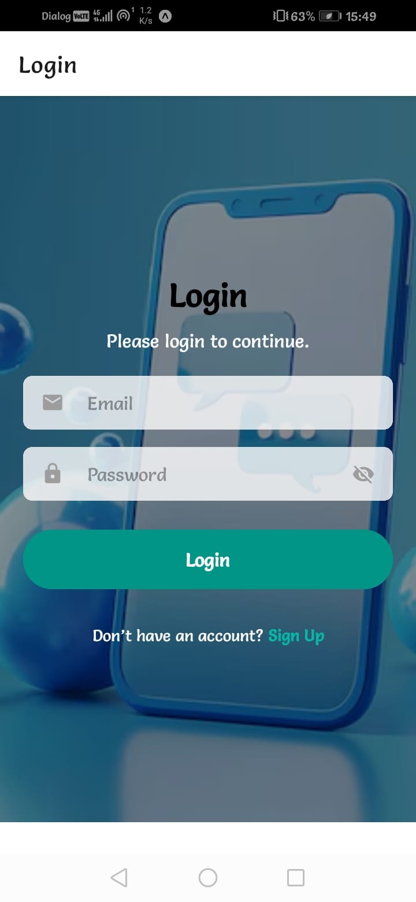
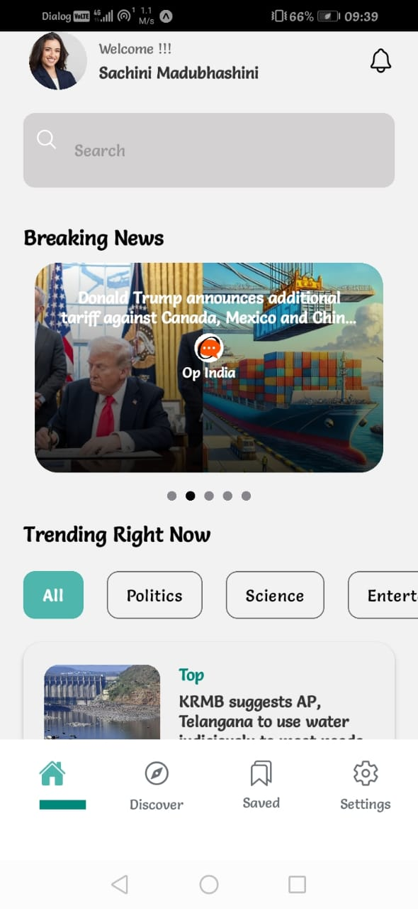
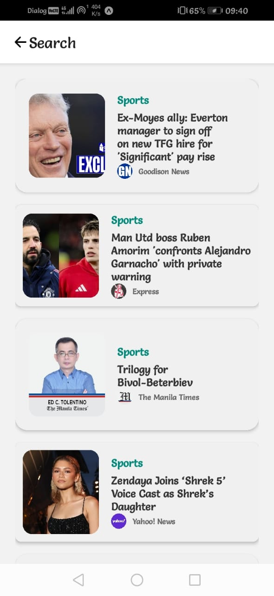
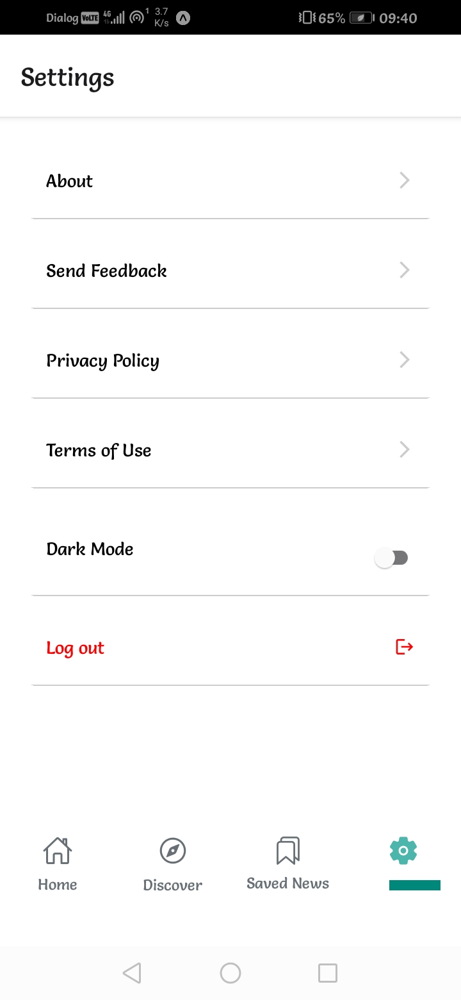

<a href="https://git.io/typing-svg">     
  
</a>


## 🌍 About the Project
Welcome to the **NovaNews App**, a React Native application built using **Expo**, designed to fetch real-time news from the [NewsData.io API](https://newsdata.io/). The app provides users with a smooth and interactive experience, utilizing advanced animations and intuitive navigation.

## 🚀 Features this adding
✅ Fetch the latest news from multiple sources.
✅ Smooth animations with **React Native Reanimated**.
✅ Stores user preferences with **Async Storage**.
✅ Optimized mobile UI with native styling.
✅ Efficient API request handling with **Axios Retry**.
✅ Styled using **Expo Linear Gradient**.

## 🛠 Tech Stack
- **Framework**: [React Native](https://reactnative.dev/)
- **Navigation**: [React Navigation](https://reactnavigation.org/)
- **Animations**: [React Native Reanimated](https://docs.swmansion.com/react-native-reanimated/docs/layout-animations/entering-exiting-animations/)
- **State Management**: React Hooks
- **Networking**: [Axios](https://axios-http.com/)
- **Async Storage**: [React Native Async Storage](https://react-native-async-storage.github.io/async-storage/docs/install/)
- **Date & Time Formatting**: [Moment.js](https://momentjs.com/)
- **Styling**: Native CSS with Expo

## 🛆 Installation
Follow these steps to set up the app:

```sh
https://github.com/sachiniwathudura/NovaNews-Mobile-App

npm install
```

Create a `.env` file and add your API key:
```sh
API_KEY=your_api_key_here
```

Start the development server:
```sh
npx expo start
```
## 📸 Screenshots
 <div style="display: flex; flex-wrap: wrap; justify-content: center; gap: 12px; text-align: center;">
  <div style="flex: 1 1 180px; max-width: 180px;">
    <h3>Main Page</h3>
    
  </div>
  <div style="flex: 1 1 180px; max-width: 180px;">
    <h3>Login Page</h3>
    
  </div>
  <div style="flex: 1 1 180px; max-width: 180px;">
    <h3>Signup Page</h3>
    
  </div>
  <div style="flex: 1 1 180px; max-width: 180px;">
    <h3>Home Page</h3>
    
  </div>
  <div style="flex: 1 1 180px; max-width: 180px;">
    <h3>Search News Page</h3>
    
  </div>
  <div style="flex: 1 1 180px; max-width: 180px;">
    <h3>Settings Page</h3>
    
  </div>
</div>


## 📝 Usage
- Browse different news categories.
- Tap on an article to read full details.
- Enjoy smooth transitions and animations.

## 🧩 Code Snippet
```javascript
import axios from 'axios';
import { useEffect, useState } from 'react';
import { API_KEY } from '@env';

const fetchNews = async () => {
  try {
    const response = await axios.get(`https://newsdata.io/api/1/news?apikey=${API_KEY}`);
    return response.data.results;
  } catch (error) {
    console.error('Error fetching news:', error);
  }
};

export default fetchNews;
```

## 📚 References
- [React Native Documentation](https://reactnative.dev/)
- [Expo Documentation](https://docs.expo.dev/)
- [React Native Reanimated](https://docs.swmansion.com/react-native-reanimated/docs/layout-animations/entering-exiting-animations/)
- [Moment.js](https://momentjs.com/)
- [NewsData.io API](https://newsdata.io/)

## 📝 License

This project is licensed under the MIT License. See the [LICENSE](LICENSE) file for details.

## 📧 Contact

For inquiries or collaboration:
- **Author:** [Sachini Madubhashini](https://github.com/sachiniwathudura)

<div align="left">
    © 2025 All Rights Reserved, Designed By Sachini Madubhashini
</div>


⭐ **Feel free to contribute, star the repo, and explore more!**

